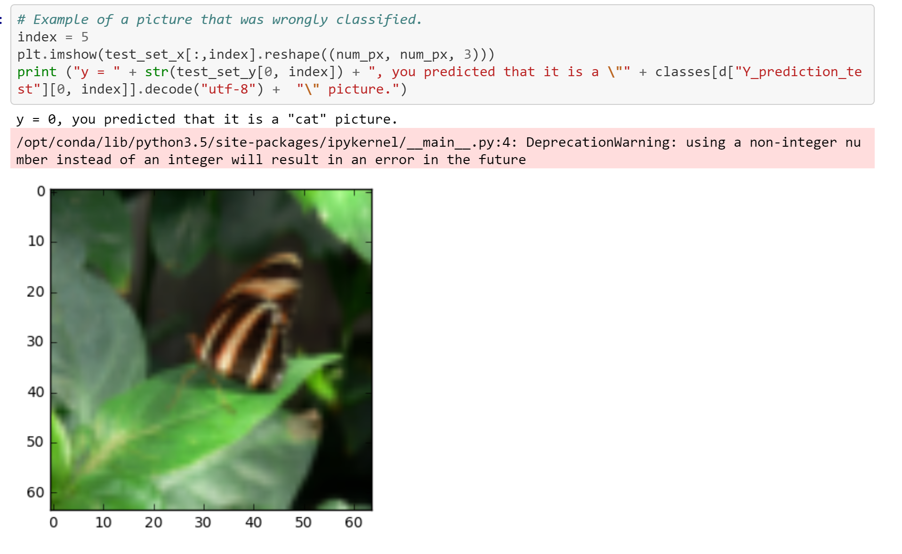

# Deep Neural Network applications

Two applicaitons of Deep Neural Networks that I build during a DNN Specialization in Coursera - Originally developed 04/05/2019

"You can find everything on the two JupyterNotebooks

## In this project it was developed 
This applicaitions were my favorite part of the course teaching me how to use frameworks to create real world projects using Deep Learning 

## Results of the Project 

